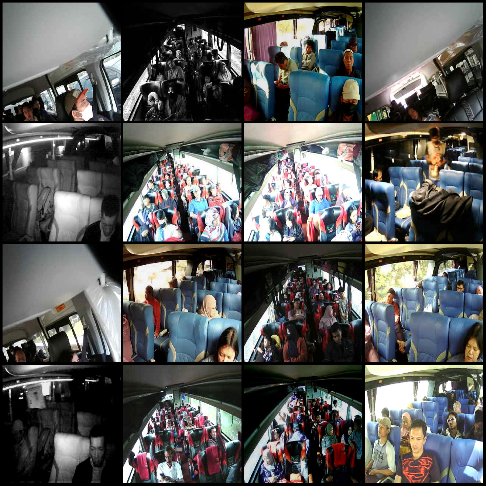
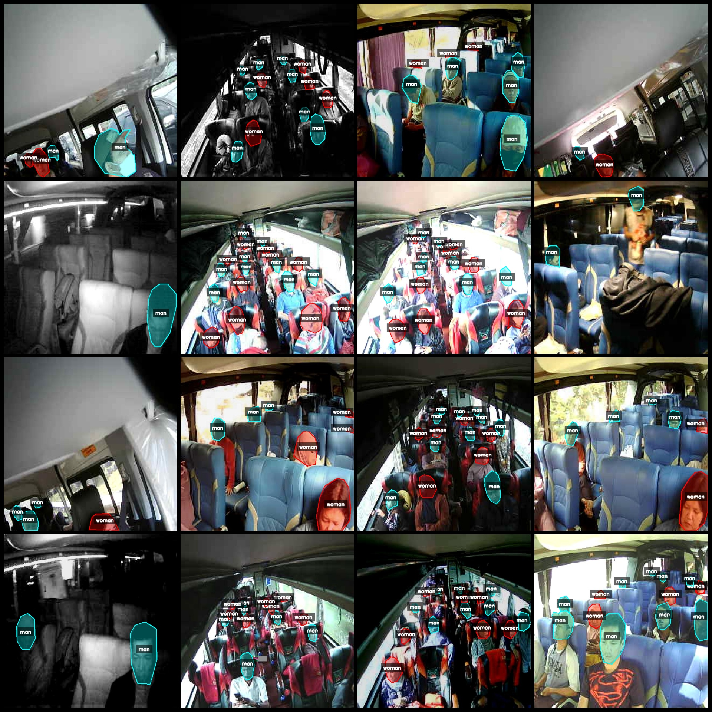
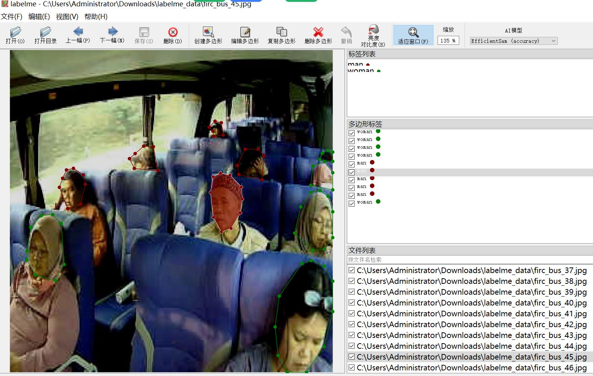
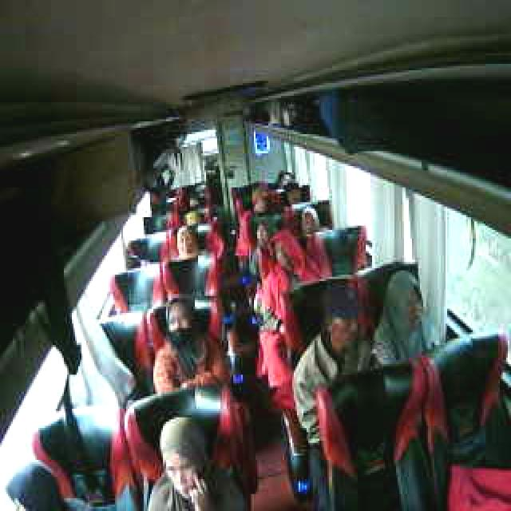

# Bus Pedestrian Segmentation Dataset with Human and Woman Identification in LabelMe Format

Please note that the images are not very clear, and you can verify the actual quality of the images by referring to the provided images below.

The dataset format is LabelMe (excluding mask files, only containing jpg images and corresponding json files).

Number of images: 1086
Number of labeled images: 1086
Number of labeled categories: 2
Labeled categories: ["man", "woman"]
Number of bounding boxes per category:
- man count = 4139
- woman count = 2665
Total bounding boxes: 6804

Labeling tool used: labelme=5.5.0
Image resolution: 640x640
Labeling rules: Polygons for class labels

Important note: The dataset can be opened and edited using LabelMe, but the json dataset needs to be converted into either a mask or COCO format for semantic segmentation or instance segmentation.

Special declaration: This dataset does not guarantee any accuracy of the trained models or weight files.

Picture preview:

Examples of labeled images:

Original images (choose 16 randomly):
Labeled drawing results:

LabelMe editing example image:
A few examples of original images, please see the quality of the dataset images mentioned here.

## Images

Here is a pay link on Stripe ( https://buy.stripe.com/3cs8yP7sY87d0vu9AB ). Please contact me lonlonago@foxmail.com after funding $89, and I will send you a complete data files , thank you!

